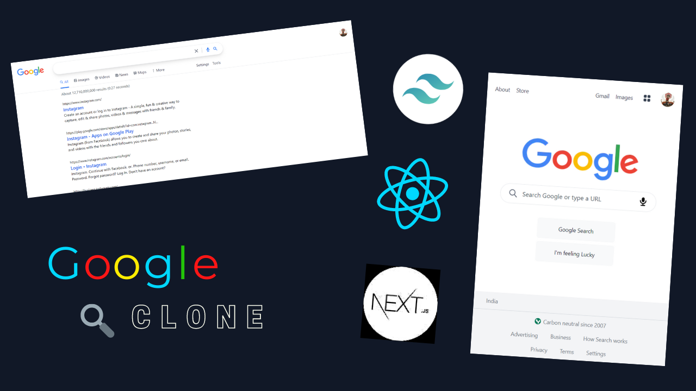

# Google 2.0

Google clone build using React (Next.js & TailwindCSS, Responsive). In this project, we are fetching data from Google API. You can request a free API key by logging in to your account on Google.
This build also includes a feature called pagination which renders two pages on user request.

### Features

- Pagination
- Responsive

### Live Site

https://google-clone-version2.vercel.app/

## Screenshots

### API Link

https://developers.google.com/custom-search/v1/introduction

### Setup

- Run `npm i && npm run dev` or `yarn install && yarn run dev`
